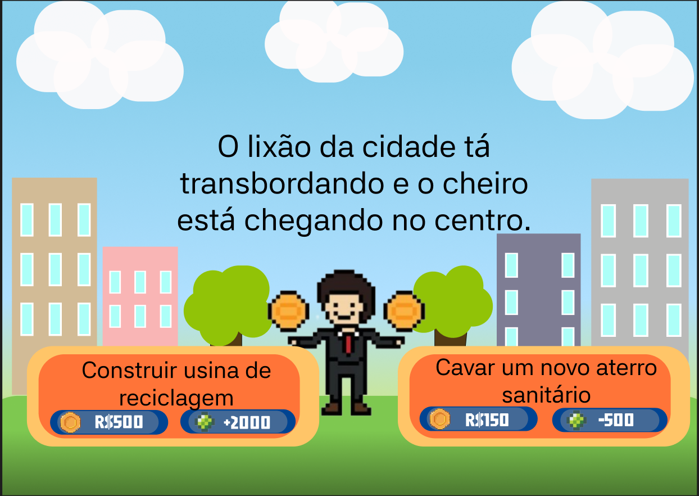

# Prints de Tela

Coloque aqui os prints de tela da aplicação desenvolvida.

> **Exemplos:** tela inicial, telas de funcionalidades principais, tela de cadastro, resultados, etc.
> Estes prints serão anexados ao relatório enviado na atividade do Canvas.

